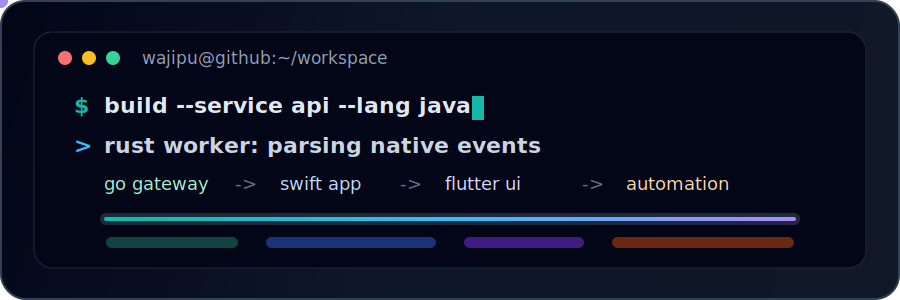
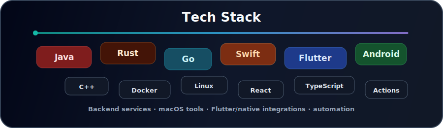
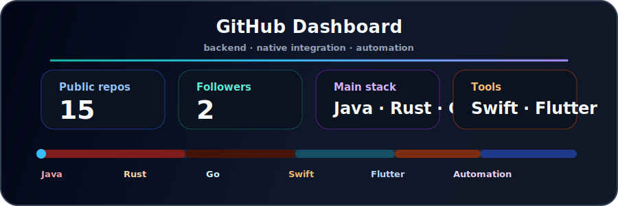

  

  

  
  
  
  

  

## 关于我

我喜欢把重复、零散、容易出错的流程整理成小而可靠的工具。当前重点在后端服务、桌面效率工具、Flutter 实验、原生设备接入、串口通信和自动化打包。

- 后端方向：Java / Rust / Go。
- 桌面工具：Swift / AppKit / macOS menu bar apps。
- 跨端与原生：Flutter / Dart / Android / C++ / serial ports。
- 工作偏好：清晰界面、稳定工具链、少步骤但能真正解决问题的项目。

## 技术栈

  

## GitHub 动态

  

  

  

## 精选项目

| 项目 | 说明 | 技术方向 |
| --- | --- | --- |
| [PicBase64](https://github.com/wajipu/PicBase64) | macOS 菜单栏图片转换、截图转 Base64、Base64 图片预览工具。 | Swift, AppKit |
| [zl_serialport_plus](https://github.com/wajipu/zl_serialport_plus) | 串口相关原生集成探索。 | C++, native |
| [my_build_demo](https://github.com/wajipu/my_build_demo) | 自动化构建和打包配置实验。 | C++, automation |
| [flutter_echart_laste_plus](https://github.com/wajipu/flutter_echart_laste_plus) | Flutter 图表集成探索。 | Flutter, Dart |
| [my-react-app](https://github.com/wajipu/my-react-app) | JavaScript / React 前端实验。 | React, JavaScript |

## 贡献动画

  <picture>
    <source media="(prefers-color-scheme: dark)" srcset="https://raw.githubusercontent.com/wajipu/wajipu/output/github-contribution-grid-snake-dark.svg" />
    <source media="(prefers-color-scheme: light)" srcset="https://raw.githubusercontent.com/wajipu/wajipu/output/github-contribution-grid-snake.svg" />
    
  </picture>

## 近期关注

- 沉淀 Java / Rust / Go 后端服务和工具链经验。
- 把 macOS 小工具做得更轻、更稳定、更少步骤。
- 整理 Flutter、Android、串口和打印相关原生集成经验。
- 减少项目噪音，让真正有用的内容更容易被看到。

  

