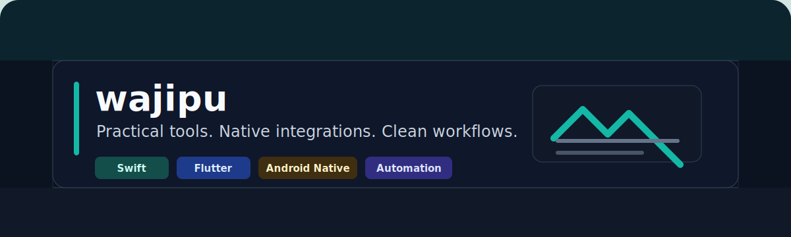

  

<h1 align="center">wajipu</h1>

  做实用工具、跨端能力、原生集成和自动化流程。

  
  
  
  
  

## 关于我

我喜欢把重复、零散、容易出错的流程整理成小而可靠的工具。当前仓库主要围绕桌面效率工具、Flutter 实验、原生设备接入、串口通信和自动化打包。

- 近期在完善 [PicBase64](https://github.com/wajipu/PicBase64)：一款轻量 macOS 菜单栏图片/Base64 工具。
- 关注 native-first 体验、Flutter 插件、Android 硬件访问、串口/打印集成和自动化工作流。
- 偏好清晰界面、清楚的项目结构，以及能直接解决真实流程的小工具。

## 技术栈

| 方向 | 工具 |
| --- | --- |
| 桌面端 | Swift, AppKit, macOS menu bar apps |
| 跨端 | Flutter, Dart, React |
| 原生集成 | Android, Java, C++, serial ports |
| 自动化 | GitHub Actions, shell scripts, packaging workflows |

## 精选项目

| 仓库 | 说明 |
| --- | --- |
| [PicBase64](https://github.com/wajipu/PicBase64) | macOS 菜单栏图片转换、截图转 Base64、Base64 图片预览工具。 |
| [zl_serialport_plus](https://github.com/wajipu/zl_serialport_plus) | 串口相关原生集成探索。 |
| [my_build_demo](https://github.com/wajipu/my_build_demo) | 自动化构建和打包配置实验。 |
| [flutter_echart_laste_plus](https://github.com/wajipu/flutter_echart_laste_plus) | Flutter 图表集成探索。 |
| [my-react-app](https://github.com/wajipu/my-react-app) | JavaScript / React 前端实验。 |

## 近期关注

- 把 macOS 小工具做得更轻、更稳定、更少步骤。
- 整理 Flutter 和原生集成相关经验。
- 减少项目噪音，让真正有用的内容更容易被看到。

## 联系

可以通过对应仓库的 Issues 或 Discussions 联系我。
